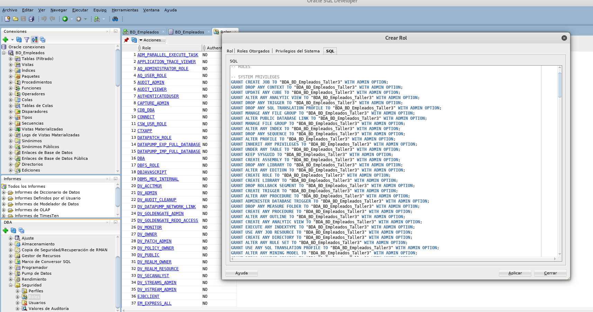
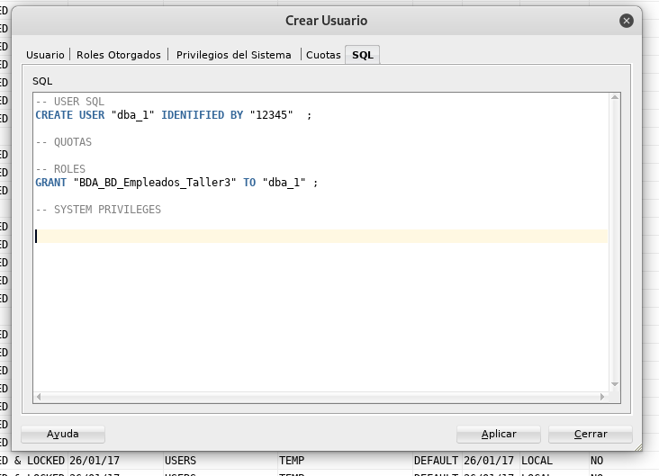
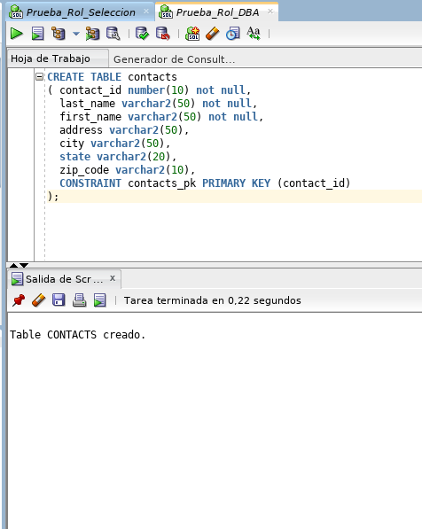
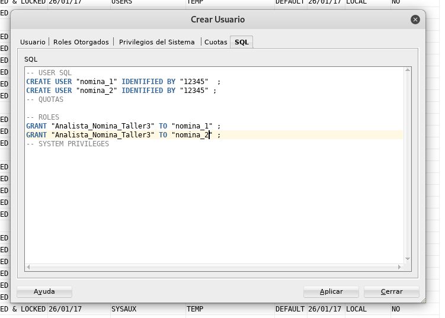
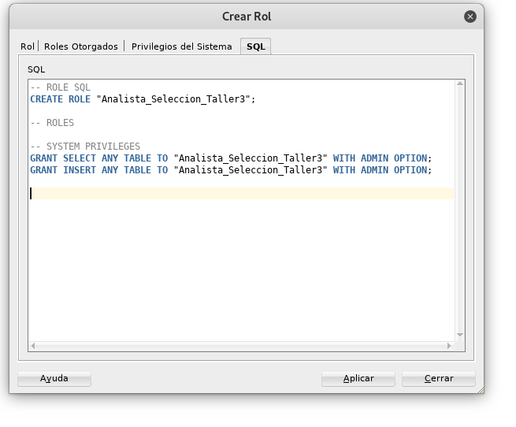
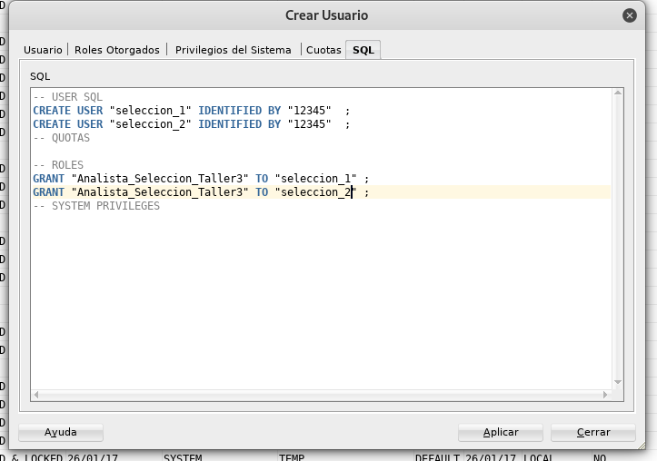

# Taller-3

DBA
	
	Creacion BD y Tablas, backups, Creacion de usuarios, Asignacion de Permisos
	Usuarios: dba_1

Analista de nomina

	Consulta de datos de empleados para pago de nomina
	Usuarios: nomina_1, nomina_2

Analista de Seleccion

	Creacion de empleados y consulta de empleados
	Usuarios: seleccion_1, seleccion_2

  	

