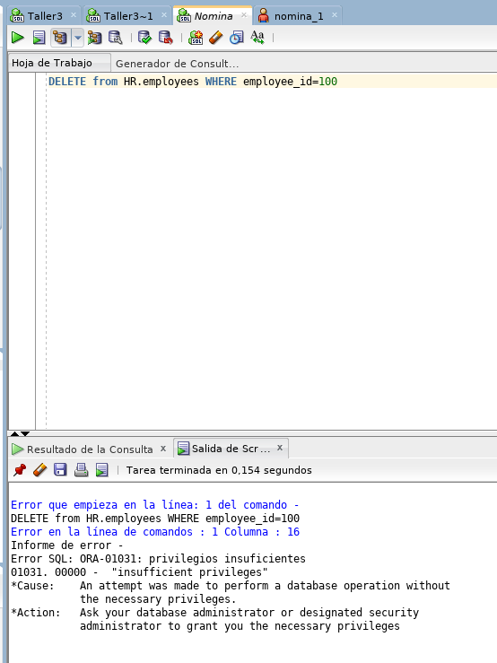

# Taller-3

Los tres roles creados para la base datos son:

DBA: 
	
	Creacion BD y Tablas, backups, Creacion de usuarios, Asignacion de Permisos
	Usuarios: dba_1

Analista de nomina

	Consulta de datos de empleados para pago de nomina
	Usuarios: nomina_1, nomina_2

Analista de Seleccion

	Creacion de empleados y consulta de empleados
	Usuarios: seleccion_1, seleccion_2

## Creación de roles y usuarios

A continuación, se presenta la creación de los roles y su asignación a cada uno de los usuarios:

### Creación del ROL DBA

### Creación de usuario "dba_1"

### Creación del rol para el análista de nomina

### Creación de los usuarios "nomina_1" y "nomina_2"

### Creación del rol para el análista de selección

### Creación de los usuarios "seleccion_1" y "seleccion_2"

## Verificación de privilegios

A continuación, se realiza la verificación de los privilegios de los usuarios de acuerdo con el rol asignado:

### Usuario "dba_1"

Creación exitosa de una tabla en la base de datos 

### Usuario "nomina_1"

Consulta exitosa de acuerdo al rol 

Eliminación fallida de información por falta de privilegios 

### Usuario "seleccion_1"

Selección exitosa de la tabla empleados 

Comando de creación de tabla fallido por falta de privilegios 

